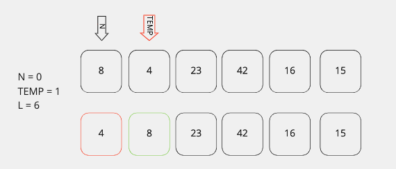
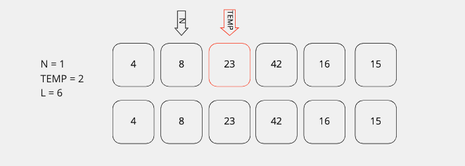
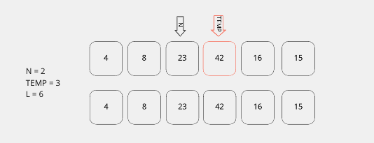
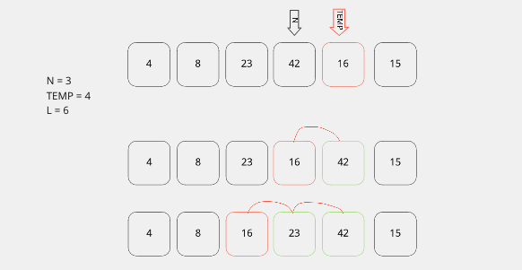
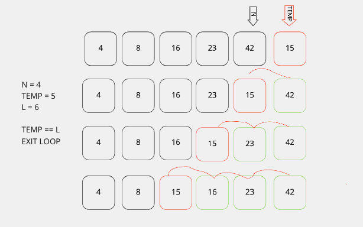

# Insertion Sort

## Problem

Create an algorithm to sort an array in place.

## Concept

Iterate through an array. For each item, move backwards through the array and compare it's value to each previous item.\
Moving the smaller values towards the front of the list.

A for loop controls iterating through the list for each value.
A while loop acts on each iteration and compares a temp value to the current pointer.

## Algorithm

Define a function that take in a list.

Set a variable (L) to hold the length of the list.\
Set a pointer (N) to the first item in the list.\
Set a pointer (TEMP) to hold a temp value.\
Set the temp to point at index 1\
Set n pointer to point at index 0\

Create a for loop to iterate through the list.

Create a while loop that runs while N greater than 0 and the Temp is less than L.\
If N is less than TEMP, do nothing.\  Add 1 to N
If N is larger than TEMP, swap values of TEMP and N

##### Round 1

First iteration the temp is lower than previous value so they swap positions.
There are no more elements, so the loop stops.
N is incremented, and the loop starts again at index 1.

##### Round 2

Second iteration starts at index 1.
The temp value is higher than the index pointer N, so nothing is swapped. 
N is incremented. Next round starts on index 2.

##### Round 3

Third iteration stats at index 2.
The temp value is higher than the pointer N, so nothing is swapped.
N is incremented. Next round starts on index 3.

##### Round 4

Fourth iteration starts at index 3.
The temp value is lower than pointer N.
While TEMP is lower than pointer TEMP-1:
  Temp and TEMP -1 swap positions.
  Pointer N decrements and compares the TEMP value each time until N == 0 or TEMP is larger than N.
  Once the TEMP is larger than N or N is 0, the loop stops.

##### Round 5

Fifth iteration starts at index 4.
The temp points to a value lower than the current pointer so the while loop is implemented.
The temp pointer and N pointer are swapped, and N is decremented.
This continues until N equals 0 or N is less than the TEMP value. 
