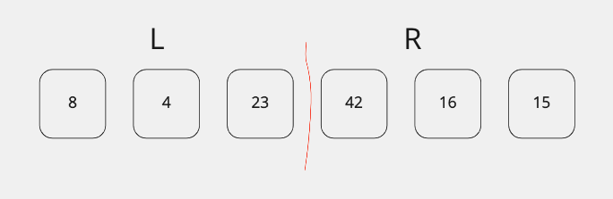
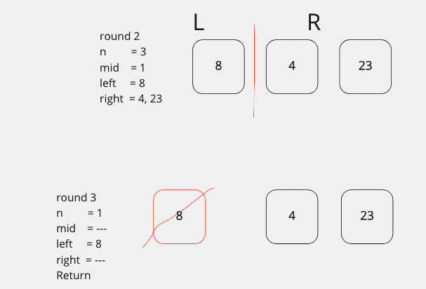
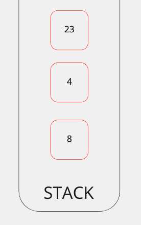
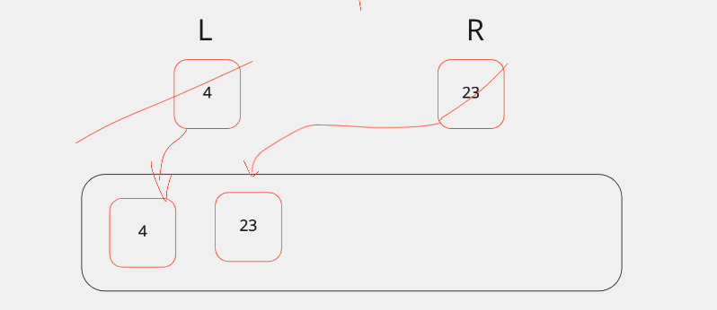
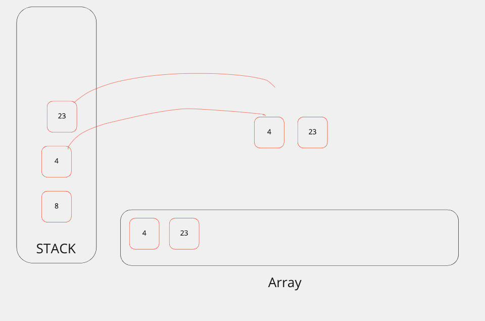
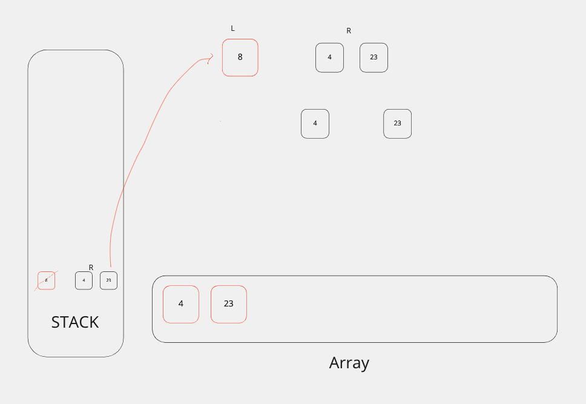
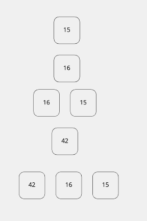
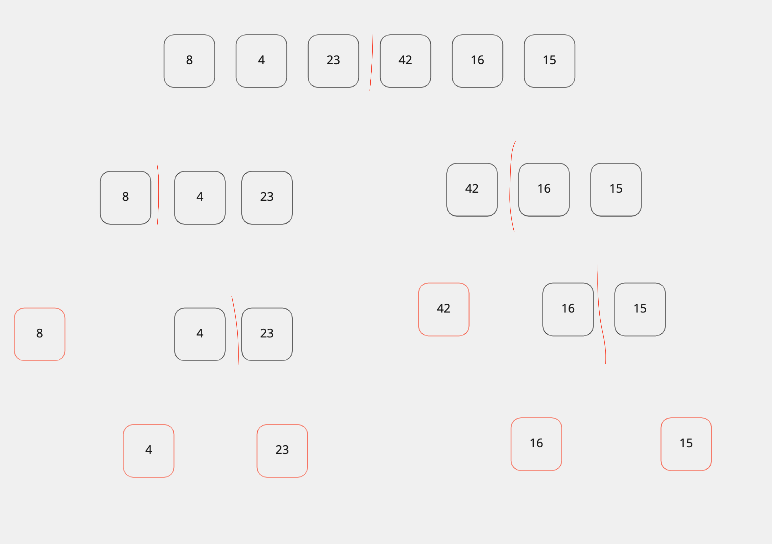

# Merge Sort

Merge sort is a method for sorting data in an array.
It uses a dived and conquer strategy. The array is divided in halve recursively first on the left, then the right side of the array.  

First the array is divided in half:
Each half is stored in a new array called left or right.
The merge sort function is then called on the left side adding it to the call stack.



### merge_sort(left)

The merge_sort function is called on the left side recursively until the length of the left array has only 1 element left.




The left array has only one value so we now move on to sorting the right side of our current array.

### merge_sort(right)


Here is the current call stack:



At this point the Left is currently assigned to 4 and the Right is assigned to 23.

### While Loop

Now we enter the second half of the algorithm.
While there are items on the call stack, the while loop unwinds the stack and checks for comparisons. Values keep shifting through the array as new lower values are added.

we set 3 pointers to 0.

```python
i = 0  # left pointer
j = 0  # right pointer
k = 0  # array pointer
```

while the length of the left is greater than i(0) and length of right is greater than j(0).

we compare the items in left and right and see which one is larger.
The smaller number is added to the array at the array pointer position K(0).



We then increment the i pointer:

```python
if left[i] <= right[j]:
  arr[k] = left[i]
  i += 1  
```

> i= 1,  k= 1,  j= 0

We continue in our loop to the next catch:

```python
while i < len(left):
  # i == 1 / len(left) == 0

# remember k = 1  j = 0
while j < len(right):
  # j == 0 / len(right) == 1
  arr[k] = right[j]
  j += 1
  k += 1
  ```

> i= 1, k=2, j= 1
> array = [ 4, 23]


The R23 and L4 values have been removed from the stack and are now in our new array.



The function call with 8 as the left value and (4,23)as the right value is now popped off the call stack.



And we continue in the while loop.

### Call Stack

The call stack starts with a call to the original array.
Then a call on the left, and then keeps splitting the first half of the array.


The original right side will be split after the first side has been added to the array.



Recursive Merge Sort Calls

