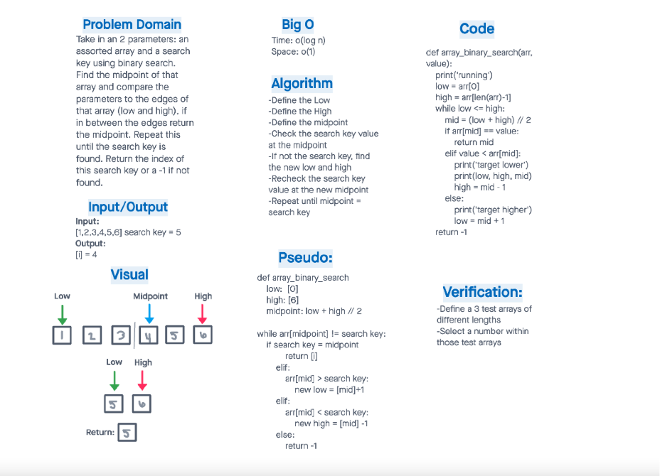

# Binary Search

[Recent PR](https://github.com/idcargill/data-structures-and-algorithms/pull/25)

## Binary Search of Sorted Array

Write a function called BinarySearch which takes in 2 parameters: a sorted array and the search key. Without utilizing any of the built-in methods available to your language, return the index of the array’s element that is equal to the value of the search key, or -1 if the element is not in the array.

## Whiteboard Process

## Approach & Efficiency

We defined a low and high index range and searched the middle index value. If the middle array value equaled the target value we returned the index position.
Otherwise we shifted the low or high points by 1 depending on if the target value was higher or lower than the middle index value.
