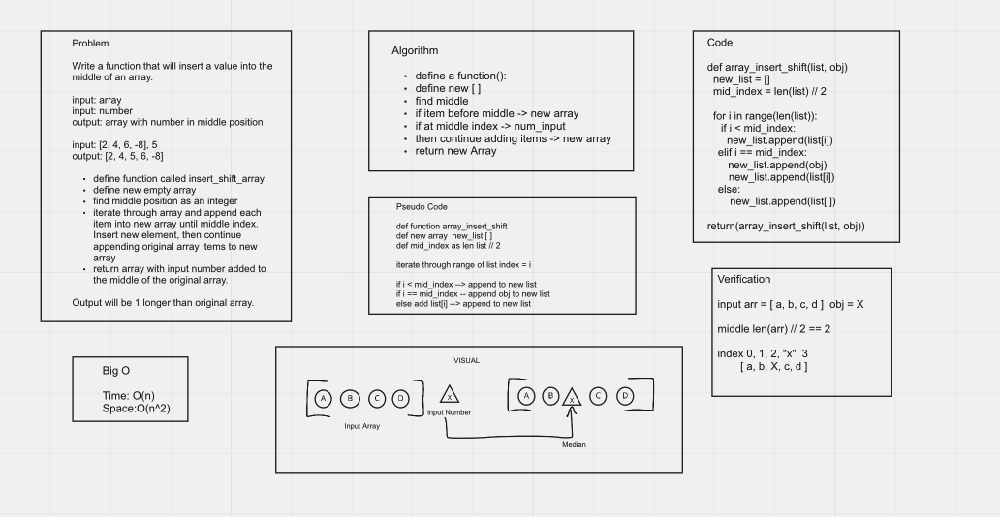

# Array Insert Shift 02

with Connor Boyce

[Recent PR](https://github.com/idcargill/data-structures-and-algorithms/pull/24)

## Insert to Middle of an Array

Write a function that will take an array and a number.  Insert the given number into the middle of the array. Return the new array.

- Write a function called insertShiftArray.
- Input: array [ 2,4,6,-8]
- Input: int 5

- Output: array [ 2,4,5,6,-8 ]
- Return array

## Whiteboard Process

## Approach & Efficiency
<!-- What approach did you take? Discuss Why. What is the Big O space/time for this approach? -->

We iterated through the length of the initial array. This gave us control over the index, allowing us to control access to the original array elements.

Time complexity O(n)
Space complexity O(n)
