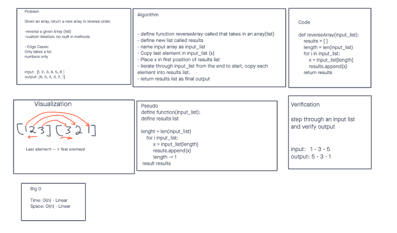

# Code Challenge 01

Ian Cargill and David Waiganjo

## Reverse and Array
<!-- Description of the challenge -->
Code Challenge 01: Given a list return a list with items in a reverse order.

## Whiteboard Process

<!-- Embedded whiteboard image -->

## Approach & Efficiency

<!-- What approach did you take? Discuss Why. What is the Big O space/time for this approach? -->
We decided to do a loop through the given list.
The Big O is linear O(n) and dependent on the size of input.

[Code Challenge Readme](https://canvas.instructure.com/courses/3826570/assignments/26339183?return_to=https%3A%2F%2Fcanvas.instructure.com%2Fcalendar%23view_name%3Dmonth%26view_start%3D2021-12-01)
