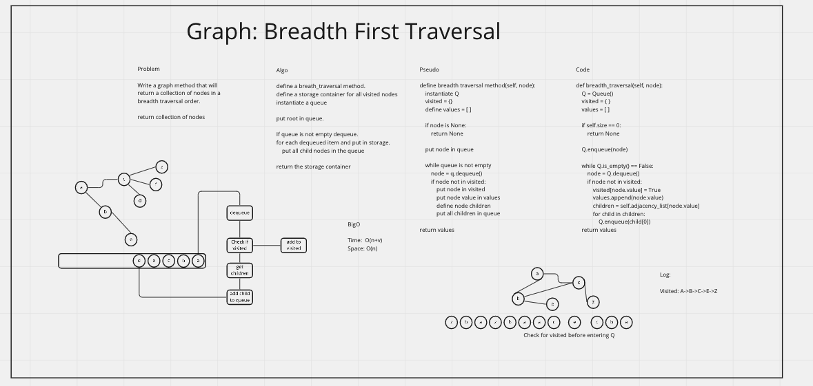

# Graph Breadth First Traversal Method

Add a breadth_first traversal method on the Graph Class.
Return a collection of visited nodes in a breadth first order.

[PR](https://github.com/idcargill/data-structures-and-algorithms/pull/56)

## Whiteboard

## Apporach

Starting from a chosen node/vertex put child nodes in a queue.
Dequeue each item and see if the node has been visited. If it has not, put it's children in the queue and record the node as visited.

### Testing

> pytest -m -v graphB
