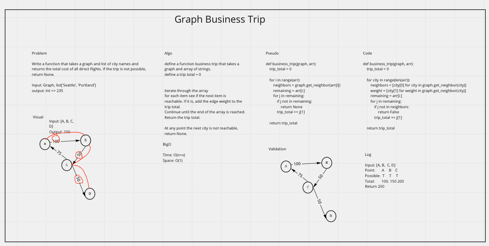

# Graph Business Trip

- Write a function called business trip
- Arguments: graph, array of city names
- Return: cost or null

Determine whether the trip is possible with direct flights, and how much it would cost.

[PR]()

## Whiteboard Process

## Approach & Efficiency

Traverse the given list of cities and check their neighbors. If the next item in the array is in the list of neighbors then add the trip value/weight to a total variable. 
If the next city to visit is not in the list of neighbors, return False.

## Testing

> pytest -m -v business

