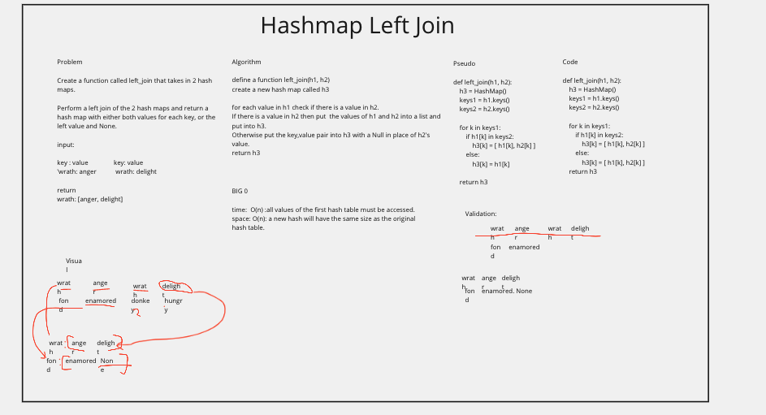

# Hash Map left join

[challenge 33](https://canvas.instructure.com/courses/3826570/assignments/26339209?return_to=https%3A%2F%2Fcanvas.instructure.com%2Fcalendar%23view_name%3Dmonth%26view_start%3D2022-03-21)

## Whiteboard Process

## Approach & Efficiency

BigO(n): The function must check every item in a hash table.

for each value in h1 check if there is a value in h2.
If there is a value in h2 then put  the values of h1 and h2 into a list and put into h3.
Otherwise put the key,value pair into h3 with a Null in place of h2's value.

## Solution

> pytest -m -v hashleft