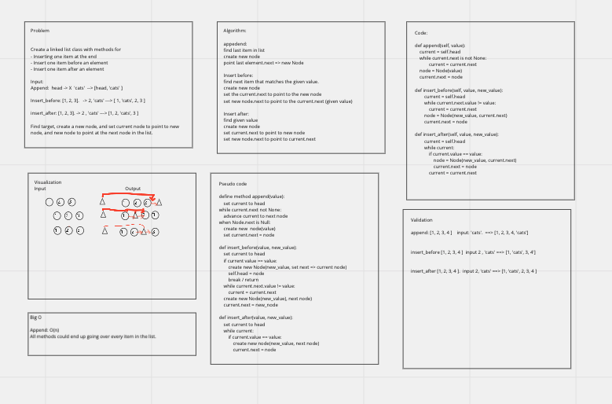

# Linked List Insertions

[Recent PR](https://github.com/idcargill/data-structures-and-algorithms/compare/linked-list-insertions?expand=1)

## Challenge Summary

Create a linked list data structure with methods for appending, inserting_before, and inserting_after a designated target.
Write unit tests for each method.

## Whiteboard Process



## Approach & Efficiency

Each method is similar and requires shifting the next node pointer to allow for the linked list to continue moving through the chain.
Moving though each item of the list, the target value is compared, a new node is created.  The node desired to be before the new node is given the new node as a next value.  The new node is set to point to the curren nodes former "next" property.

## Solution

```python

def insert_after(self, value, new_Value):
    current = self.head
    while current:
        if current.value == value:

            # create new node
            node = Node(new_Value, current.next)

            # set desired previous node to point at new node
            current.next = node
            return
        current = current.next


```
