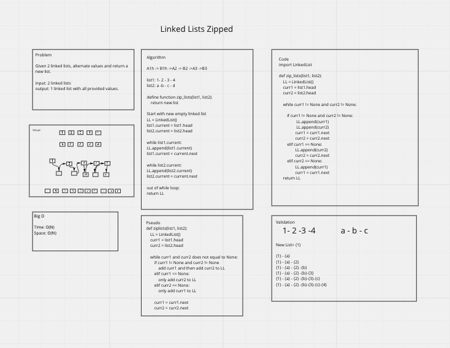

# Linked List Zip

[Recent PR](https://github.com/idcargill/data-structures-and-algorithms/pull/30)

## Problem

Given a linked list, join the lists into one.  Each node should alternate between the previous lists.

## Whiteboard

