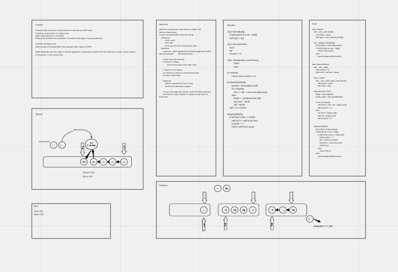

# Animal Shelter

## Challenge Summary
<!-- Description of the challenge -->
1. Create a class called AnimalShelter which holds only dogs and cats.
2. The shelter operates using a first-in, first-out approach.
3. Implement Methods:

- enqueue
      Arguments: animal\
      animal can be either a dog or a cat object.
- dequeue
      Arguments: pref
      pref can be either "dog" or "cat"\
      Return: either a dog or a cat, based on preference.
      If pref is not "dog" or "cat" then return null.

## Whiteboard Process

## Approach & Efficiency
<!-- What approach did you take? Why? What is the Big O space/time for this approach? -->

## Solution
<!-- Show how to run your code, and examples of it in action -->
