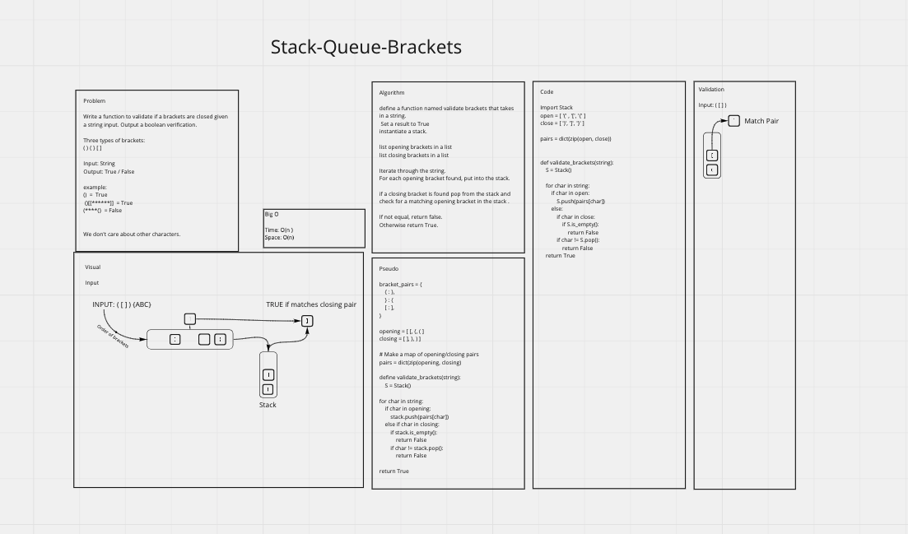

# Stack Queue Brackets

Write a function called validate brackets
- Arguments: string
- Return: boolean
- representing whether or not the brackets in the string are balanced

> {}()   True

> {([]}  False

## Whiteboard Process



## Approach & Efficiency

Iteration through the string argument items matching opening brackets are put into a stack. When at closing bracket is reached the top value of the stack is popped.  
If the top item in the stack maps to a matching closing bracket then the iteration continues.
If there is ever a mis-matched pair, then the function returns False.
Returns True by default.

## Solution

```python

open = ['(', '{', '[']
close= [')', '}', ']']
pairs_map = dict(zip(open, close))

# Catch miss matched closing brackets with those in the stack.
if char != paris_map[S.pop()]:
  return False

```