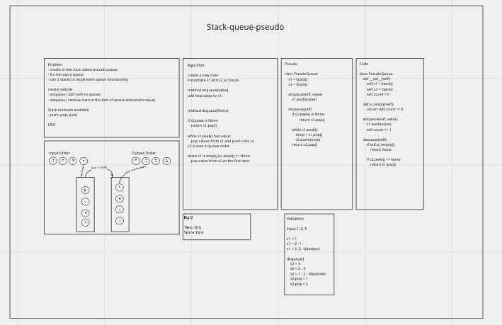

# Stack and Queue Pseudo
<!-- Description of the challenge -->
- Implement a Queue using two Stacks.
- Create a new class called pseudo queue.
- Do not use an existing Queue.
- Instead, this PseudoQueue class will implement our standard queue interface (the two methods listed below),
- Internally, utilize 2 Stack instances to create and manage the queue

## Whiteboard Process
<!-- Embedded whiteboard image -->

## Approach & Efficiency
<!-- What approach did you take? Why? What is the Big O space/time for this approach? -->
Created 2 stacks. When adding to the queue stack1 is loaded.
When removing items stack 1 is emptied onto stack2 and the value of stack2.pop is returned.
Stack 1 pushes onto stack 2 in reverse stack 1 order.
Stack 2 pops off values in the same order as they were taken in to the pseudo queue class.

### BigO

Time: O(1)
Space: O(1)

## Solution
<!-- Show how to run your code, and examples of it in action -->

> PQ = PseudoQueue()

> PQ.enqueue('a')

> PQ.enqueue('b')

> PQ.dequeue() => 'b'
