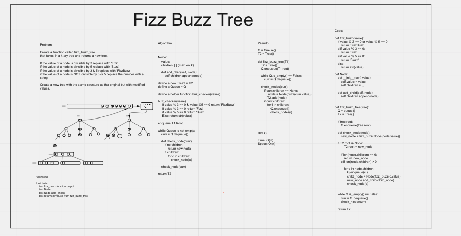

# Tree Fizz Buzz

[Recent PR](https://github.com/idcargill/data-structures-and-algorithms/pull/45)

Write a function called fizz buzz tree

- Arguments: k-ary tree
- Return: new k-ary tree

Determine whether or not the value of each node is divisible by 3, 5 or both.\
Create a new tree with the same structure as the original, but the values modified as follows:

- If the value is divisible by 3, replace the value with “Fizz”
- If the value is divisible by 5, replace the value with “Buzz”
- If the value is divisible by 3 and 5, replace the value with “FizzBuzz”
- If the value is not divisible by 3 or 5, simply turn the number into a String.

## Whiteboard Process

## Approach & Efficiency

Several helper functions help with processing.

- fizz_buzz() returns fizz_buzzed value conversion
- Node class has an add_child(node) method
- check_node(node) is an internal helper function for fizz_buzz_tree() that checks node values and returns fizz_buzz converted Nodes with child lists.

## Solution

Load the tree root into a queue. While Queue has value, dequeue each node and convert values through fizz_buzz() function, as well as all child elements. Each iteration should build out a 'tree' for each child of the root.

There is no tree, only a root node pointing to a children container.

### Pytest

> pytest -v -m fizzbuzz
