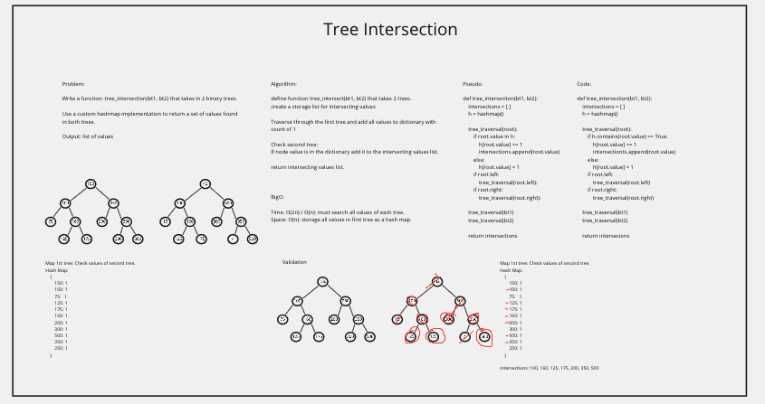

# Tree Intersection

[Code Challenge - 32](https://canvas.instructure.com/courses/3826570/assignments/26339208?return_to=https%3A%2F%2Fcanvas.instructure.com%2Fcalendar%23view_name%3Dmonth%26view_start%3D2022-03-14)

## Whiteboard Process

## Approach & Efficiency

Traverse the first tree and put all values in a hash table. 
On the second tree, traverse and check each value if it exists in hash table. If it does, add it to a list of intersected values.

## Test

> pytest -v -m tree_intersect
