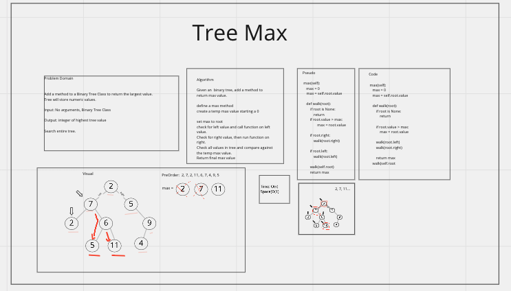

# Tree Max

## Whiteboard Process

## Approach & Efficiency
<!-- What approach did you take? Why? What is the Big O space/time for this approach? -->
Define a temp max value and compare each value to each node in the tree.
Traverse each node in the tree and compare to a max value.

## Solution

> BinaryTree.max()  # returns max from numeric value in tree.
