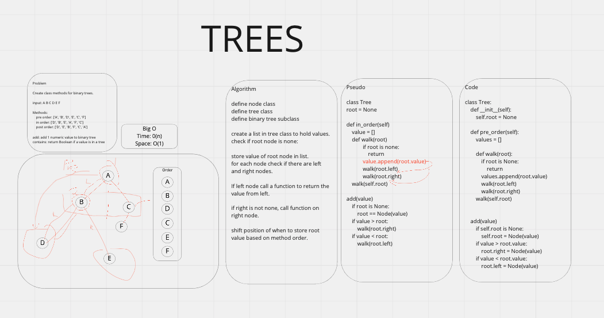

# TREES

- Create a Node class
- Create a Tree class
- Create a Binary_Tree Class

## Methods

- pre_order
- in_order
- post_order

## Binary Methods

- add(value)
- contains(value) returns 

## Approach & Efficiency

Recursive tree traversal. O(n)

While looking for or collecting values in a tree a method is called on each node. 
If the node is invalid or None, then the function is stopped with a return. 

The function calls load up the call stack and are popped off as the functions hit return statements.
